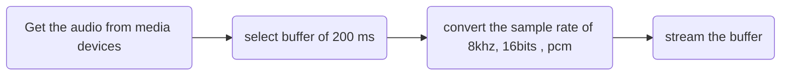
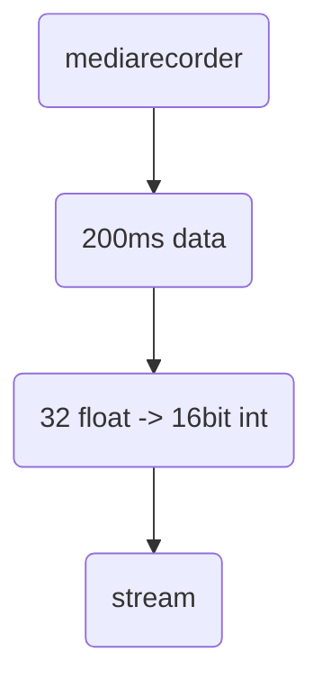
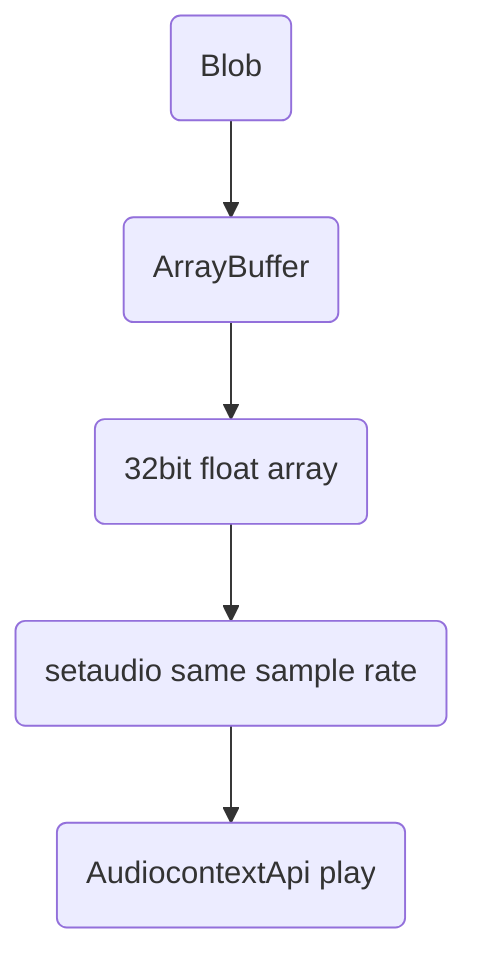

- [audio characteristics](#audio-characteristics)
- [Fromula](#fromula)
- [Audiocontext architecture](#audiocontext-architecture)
- [Audio receive](#audio-receive)

# audio characteristics

| characteristics | value   |
| --------------- | ------- |
| sampling freq   | `8Khz`  |
| time            | `200ms` |
| bit rate        | `16bit` |
| sampling rate   | 16000   |
| array length    | 3200    |
| format          | pcm     |

# Fromula

$time=length/samplingRate$

$length=0.2*16000=3200$

---

# Audiocontext architecture

# Audio receive

https://stackoverflow.com/questions/64758250/why-does-the-mimetype-of-media-recorder-change-when-i-start-recording

https://base64.guru/converter/decode/audio

https://codepen.io/xewl/pen/NjyRJx

https://www.npmjs.com/package/recordrtc
